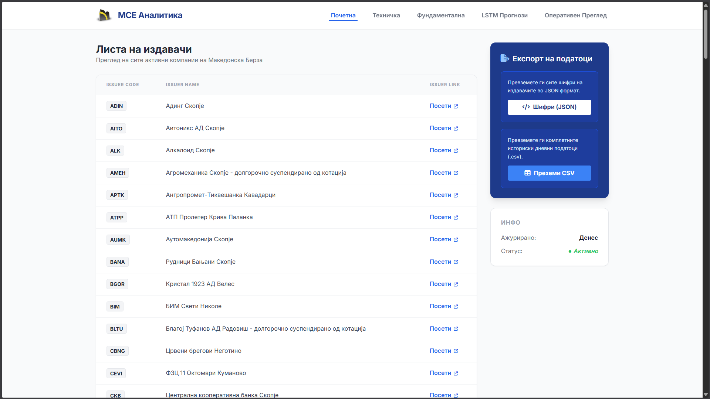
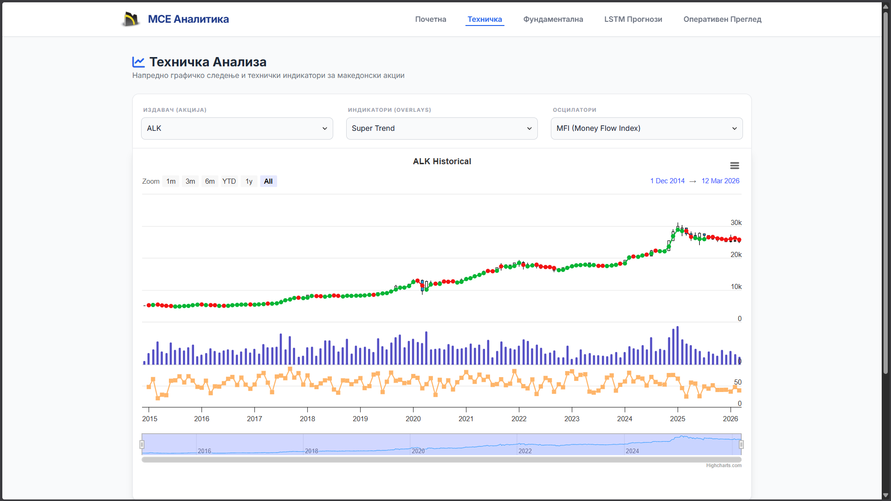
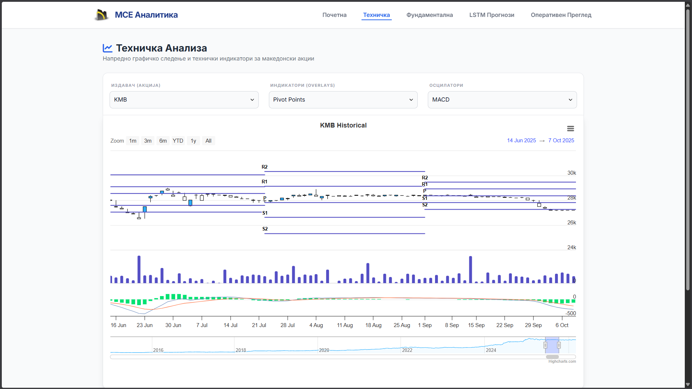
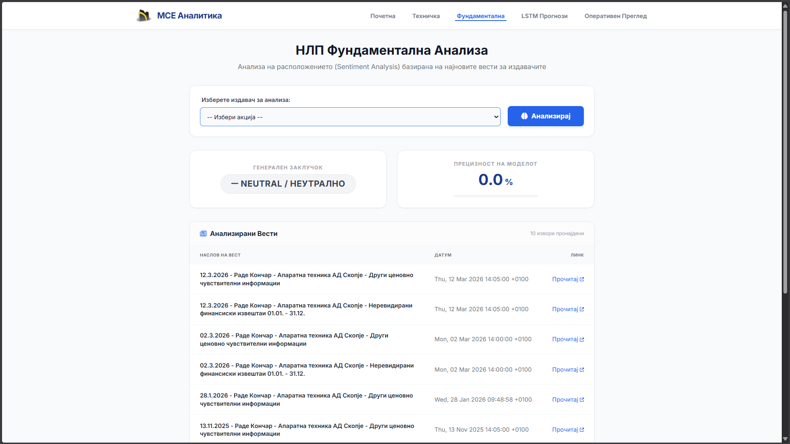
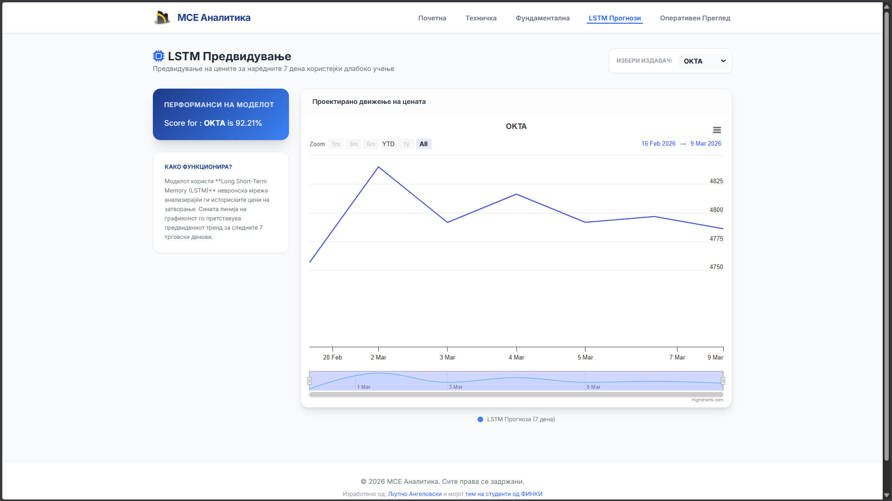

# MSE Analytics

A web platform for tracking and predicting stock data from the Macedonian Stock Exchange. This project integrates a
**Spring Boot** backend with **Python** scripts to handle data scraping, analysis, and machine learning.

---

<!-- TOC -->
* [MSE Analytics](#mse-analytics)
  * [Project Overview](#project-overview)
  * [Technical Stack](#technical-stack)
  * [Getting Started](#getting-started)
    * [1. Prerequisites](#1-prerequisites)
    * [2. Check Versions](#2-check-versions)
      * [2.1 JDK and Maven Configuration](#21-jdk-and-maven-configuration)
    * [2. Activate the Environment](#2-activate-the-environment)
    * [3. Build the Project](#3-build-the-project)
    * [4. Setup Python Environment](#4-setup-python-environment)
    * [5. Running the App](#5-running-the-app)
  * [How it works](#how-it-works)
  * [API Endpoints](#api-endpoints)
<!-- TOC -->

---

## Project Overview

The app is built to automate the workflow of a stock analyst. Instead of manually checking the MSE website, the system:

1. **Scrapes** daily data automatically using Playwright and Beautiful Soup.
2. **Calculates** technical indicators (Moving Averages, RSI, etc.).
3. **Processes** news and reports using NLP to judge market sentiment.
4. **Predicts** future prices using an LSTM (Long Short-Term Memory) neural network.
5. **Monitors** all these background processes through a real-time progress dashboard.

## Technical Stack

* **Backend:** Java 17 (Spring Boot)
* **Frontend:** Thymeleaf, Tailwind CSS, Highcharts.js
* **Python:** Pandas, NumPy, Scikit-learn, TensorFlow/Keras
* **Automation:** Playwright (Chromium), Beautiful Soup
* **Project Management:** Maven

---

## Getting Started

### 1. Prerequisites

* **JDK 17** and **Maven 3.9+**
* **Python 3.11** and `pip`

### 2. Check Versions

Open your terminal and verify your environment:

```powershell
java -version
mvn -v
```

#### 2.1 JDK and Maven Configuration

If your global Java version is different from **JDK 17**, you can use the provided environment script to isolate this
project without changing your system-wide settings.

1. Download the **JDK 17 (ZIP version)** and extract it (e.g., to `C:\Java\jdk-17`).
2. Use the `env.ps1` script located in the root directory:

```powershell
# env.ps1 script content:
$env:JAVA_HOME = "C:\Java\jdk-17"  # Update this path to your JDK 17 location
$env:Path = "$env:JAVA_HOME\bin;" + $env:Path
[Environment]::SetEnvironmentVariable("JAVA_HOME", $env:JAVA_HOME, "Process")

Write-Host "--- Java 17 Session Active ---" -ForegroundColor Cyan
java -version
mvn -v

```

### 2. Activate the Environment

To apply these settings to your current terminal session, use **dot-sourcing** (note the space after the first dot):

```powershell
. .\env.ps1

```

### 3. Build the Project

Use Maven to install dependencies and build the Java application:

```powershell
mvn clean install
```

### 4. Setup Python Environment

To keep the Python dependencies isolated, create a virtual environment:

```powershell
# Create venv
py -3.11 -m venv .venv

# Activate it
.\.venv\Scripts\Activate

# Install requirements
pip install -r requirements.txt

# Setup Playwright for scraping
python -m playwright install chromium

```

### 5. Running the App

Once everything is configured, start the Spring Boot server:

```powershell
mvn spring-boot:run
```

Open your browser and navigate to `http://localhost:8080`.

## How it works

The application uses a **ProcessBuilder** approach in Java to trigger Python scripts.

* **Data Flow:** Python handles the heavy math and scraping, then saves results (JSON/CSV) or sends logs back to the
  Spring Boot app.
* **Live Monitoring:** The "System Pulse" page polls a custom API to show the current progress of the scripts, including
  ETA and logs.
* **Forecasting:** The LSTM model is trained on historical data and provides a 7-day price projection visualized with
  Highcharts.

## API Endpoints

| HTTP Method | Endpoint                       | Controller               | Return Type    | Description                                   |
|-------------|--------------------------------|--------------------------|----------------|-----------------------------------------------|
| **GET**     | `/`                            | `GetController`          | HTML Template  | Home page (redirects to index)                |
| **GET**     | `/index`                       | `GetController`          | HTML Template  | Main index page                               |
| **GET**     | `/scr`                         | `GetController`          | HTML Template  | Triggers Python script 'Main' and shows index |
| **GET**     | `/tech_analysis`               | `GetController`          | HTML Template  | Technical analysis page                       |
| **GET**     | `/fundamental`                 | `GetController`          | HTML Template  | Fundamental analysis page with dropdown       |
| **GET**     | `/lstm`                        | `GetController`          | HTML Template  | LSTM prediction page                          |
| **POST**    | `/fundamental`                 | `PostController`         | HTML Template  | Shows fundamental analysis for specific code  |
| **GET**     | `/download/mega-data.csv`      | `FileDownloadController` | CSV File       | Downloads mega-data.csv file                  |
| **GET**     | `/download/processed_lstm.csv` | `FileDownloadController` | CSV File       | Downloads processed LSTM data                 |
| **GET**     | `/download/issuer_names.json`  | `FileDownloadController` | JSON File      | Downloads issuer names                        |
| **GET**     | `/download/names.json`         | `FileDownloadController` | JSON File      | Downloads names list                          |
| **GET**     | `/flag-status`                 | `FlagController`         | JSON (Boolean) | Returns Python runner flag status             |
| **GET**     | `/progress`                    | `ProgressPageController` | HTML Template  | Script progress monitoring page               |
| **GET**     | `/api/progress/{scriptName}`   | `ProgressApiController`  | JSON           | Returns progress for specific script          |
| **GET**     | `/api/progress`                | `ProgressApiController`  | JSON           | Returns progress for all scripts              |

**HTML Templates**: `index`, `tech_analysis`, `fundamental`, `lstm`, `progress`

**API Endpoints**: 7 endpoints (4 file downloads, 1 flag status, 2 progress endpoints)

## Images

### Home page

Home page with navigation and summary of features.

### Technical Analysis

Technical analysis page showing various indicators and charts.

<br>


Technical analysis page showing different indicators and charts and zoomed in on the price chart.

### Fundamental Analysis

Fundamental analysis page showing sentiment analysis results of the news articles for the stock.

### LSTM Prediction

LSTM prediction page showing the predicted stock price for the next 7 days.

### System status and progress monitoring

System pulse page showing the progress of the background Python scripts in real-time.


